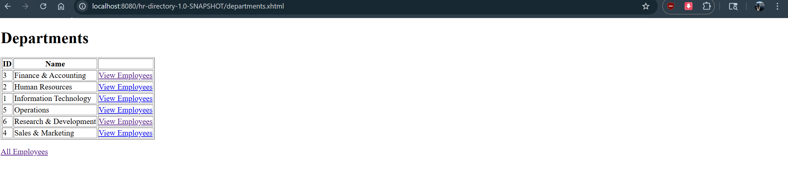

# HR Directory (JSF + JPA + Service Layer + RBAC)

A small Jakarta EE web application for viewing and managing an HR directory.
It uses:
- JSF/Facelets for UI
- JPA/JPQL for persistence
- EJB service layer for transactions/business logic
- Payara container-managed security (file realm) for RBAC

## Features
- Department list page (read): view all departments and navigate to employees by department
- Employee list page (read + filter): view all employees, filter by department, and search by name/title (JPQL with parameters)
- ADMIN-only edit page (write): update employee title and salary (with validation and success message)
- Validation:
    - Title is required (not blank)
    - Salary must be >= 0

## Tech Stack
- Jakarta EE 11 (Payara Server)
- JSF 4 (Facelets)
- JPA (EclipseLink via Payara)
- MySQL (JDBC DataSource in Payara)

## How to Run (local)
1. Ensure MySQL is running and the `itmd415_hr` schema is created with tables/data.
2. Configure Payara JDBC Resource (JNDI) and security users (see `DEPLOYMENT.md` and `SECURITY.md`).
3. Deploy the WAR to Payara.
4. Open the app URLs below.

## URLs (Key Pages)
Assuming context root: `/<CONTEXT_ROOT>` (example: `/hr-directory-1.0-SNAPSHOT`)

- Home:
    - `http://localhost:8080/<CONTEXT_ROOT>/`
- Departments:
    - `http://localhost:8080/<CONTEXT_ROOT>/departments.xhtml`
- Employees:
    - `http://localhost:8080/<CONTEXT_ROOT>/employees.xhtml`
- Edit Employee (ADMIN only):
    - `http://localhost:8080/<CONTEXT_ROOT>/editEmployee.xhtml?empId=101`

## Test Accounts (Payara file realm)
- USER: `user1` (group `USER`)
- ADMIN: `admin1` (group `ADMIN`)

## Screenshots 

- Department list page displayed in a browser 

- Employee list page displayed in a browser (with filter or search visible)

- Edit Employee page (or edit flow) as ADMIN

--- 